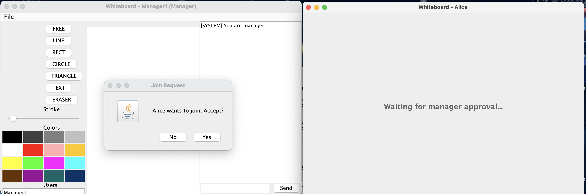
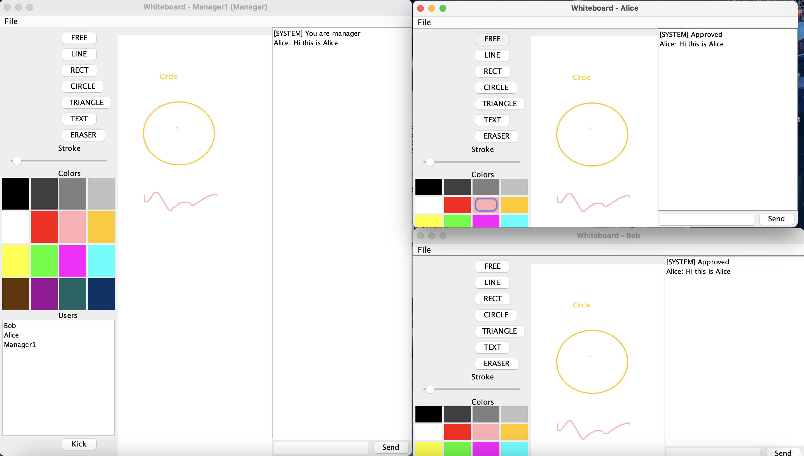
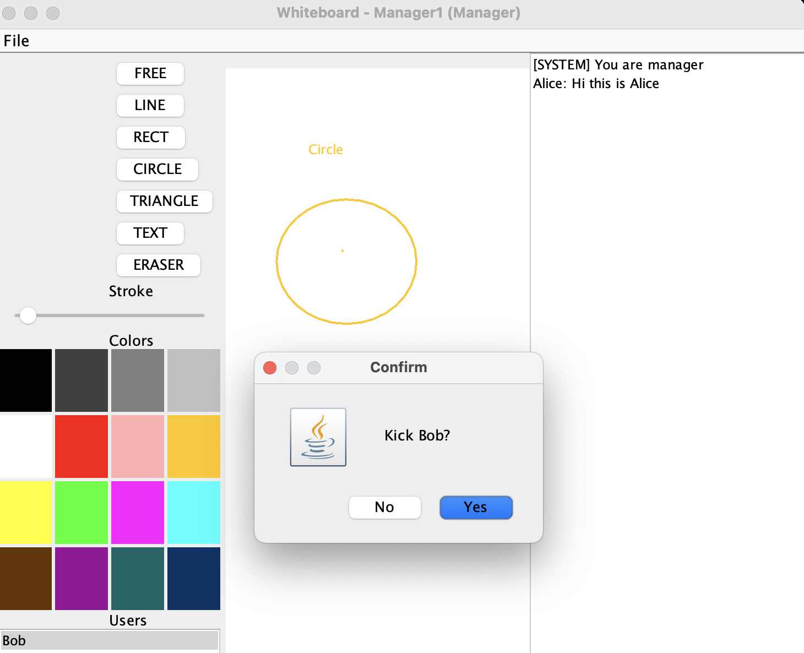
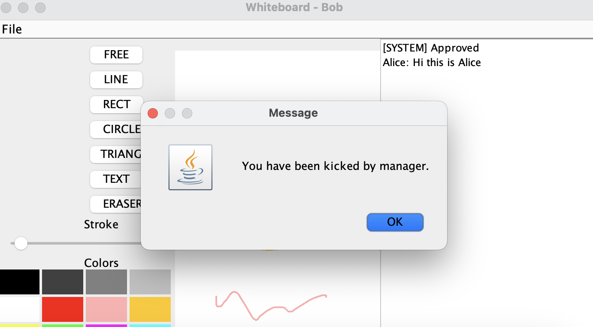

# Distributed Shared Whiteboard

A Java-based **Distributed Shared Whiteboard** that enables multiple users to draw, edit shapes, type text, and collaborate in real time over a network. The system demonstrates distributed systems concepts including networking, concurrency handling, and synchronized state sharing.  

Built as part of the *Distributed Systems & Applications* coursework at the University of Melbourne.

---

## ✨ Features

### ✔ Real-Time Collaborative Drawing
- Freehand drawing  
- Line, rectangle, circle, triangle  
- Text tool for typing anywhere  
- Eraser with multiple sizes  
- 16+ color palette  
- Adjustable stroke width  

### ✔ Multi-User Distributed System
- Manager creates the whiteboard  
- Clients join using IP + port  
- Manager approves/rejects join requests  
- Live synchronized updates across all clients  
- Active users list  
- Manager can **kick** users  
- If the manager leaves, all users are disconnected  

### ✔ Advanced Features
- Integrated chat window  
- File menu: **New, Open, Save, Save As, Close**

---

## 📸 Screenshots

> Upload images to your GitHub repo → copy the link → replace below.

### Join Request  


### Waiting for Approval  


### Collaborative Drawing  


### Kick User (Manager View)  


### Kicked Client View  


---

## 🛠 How to Run (Mac/Linux/Windows)

### 1. Compile the project
```bash
javac *.java

2. Start the Manager (Server)
bash
Copy code
java CreateWhiteBoard <serverIP> <port> <managerName>
Example:

```bash
Copy code
java CreateWhiteBoard localhost 5000 Manager1
3. Start a Client
```bash
Copy code
java JoinWhiteBoard <serverIP> <port> <username>
Example:

```bash
Copy code
java JoinWhiteBoard localhost 5000 Alice
📂 Project Structure
arduino
Copy code
/src
   ├── CreateWhiteBoard.java
   ├── JoinWhiteBoard.java
   ├── Server.java
   ├── Client.java
   ├── GUI/
   ├── utils/
   └── ...
/images
README.md
📡 System Design Overview
Manager–Client architecture

Java Sockets/RMI communication

Broadcast-based event propagation

Multi-threaded request handling

Full board snapshot sent when a new client joins

🎯 Learning Outcomes
Real-time distributed collaboration

Message-based communication design

Java GUI development (Swing/Java2D)

Handling concurrency and user events

Maintaining consistency across clients
